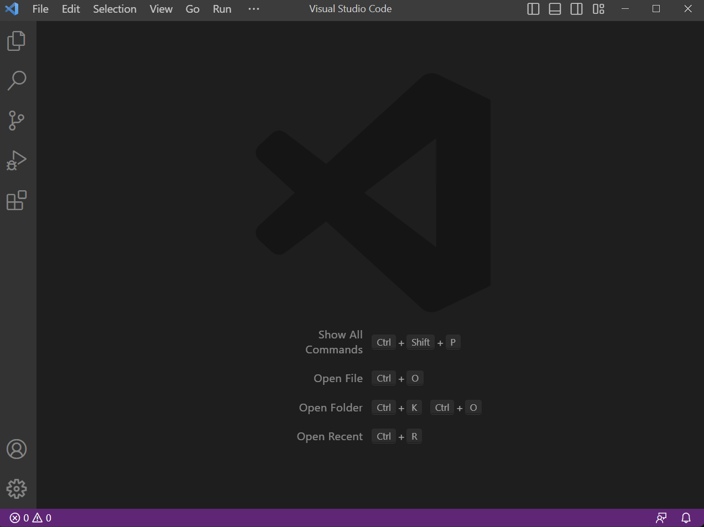

# Lab Report 1: Remote Access and File System
1. Downloading VS Code

    Download VS Code [here](https://code.visualstudio.com/download). Follow the download instructions and after it is installed, open VS Code. 
     It should look like this when you first open it. If you are instead using a computer in the lab, it should be installed already. 

2. Remotely Connecting 
    
    To remotely connect, you will need to use git. If you are using a Windows device, you need to install it [here](https://gitforwindows.org/). To set up bash in VS Code on Windows, follow the instructions [here](https://stackoverflow.com/questions/42606837/how-do-i-use-bash-on-windows-from-the-visual-studio-code-integrated-terminal/50527994#50527994). Now that you have set up bash you are ready to remotely connect to another computer.
    
    1. Access your CSE15L account at: (https://sdacs.ucsd.edu/~icc/index.php)[https://sdacs.ucsd.edu/~icc/index.php]. After logging in click the button shown below. You should know see this page. 
    2. Click on Global Password Change Tool to reset your password. 

