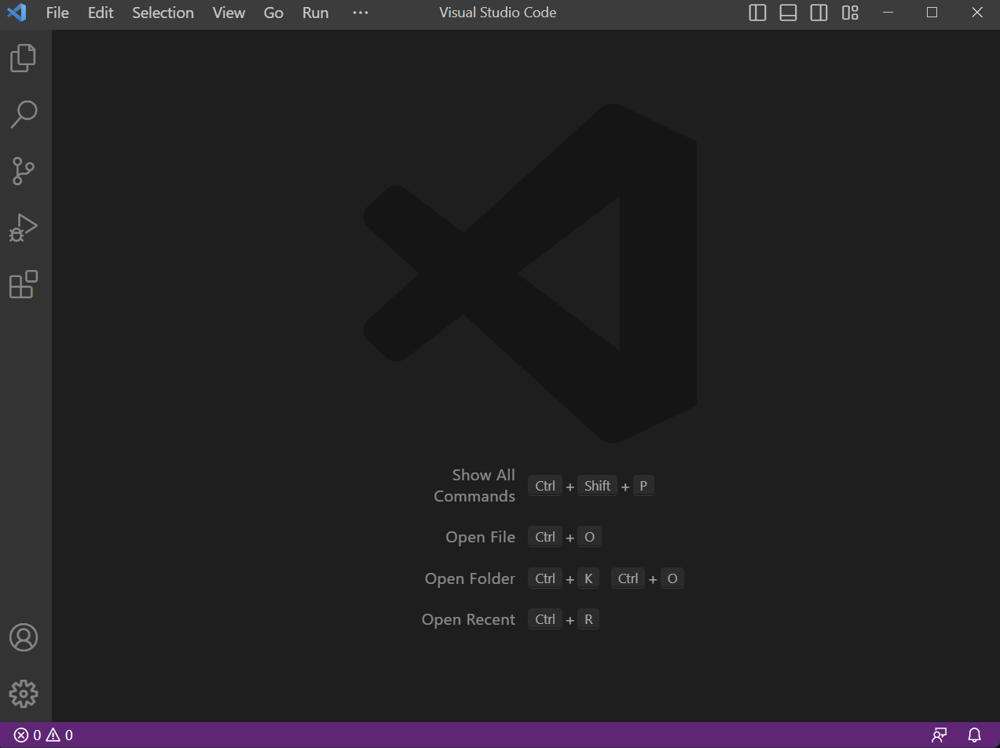
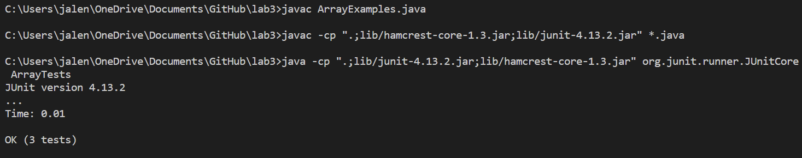

# Lab Report 1: Remote Access and File System
 ## 1. Downloading VS Code ##

    Download VS Code [here](https://code.visualstudio.com/download). Follow the download instructions and after it is installed, open VS Code. 
     It should look like this when you first open it. If you are instead using a computer in the lab, it should be installed already. 

## 2. Remotely Connecting ##
    
    To remotely connect, you will need to use git. If you are using a Windows device, you need to install it [here](https://gitforwindows.org/). To set up bash in VS Code on Windows, follow the instructions [here](https://stackoverflow.com/questions/42606837/how-do-i-use-bash-on-windows-from-the-visual-studio-code-integrated-terminal/50527994#50527994). Now that you have set up bash you are ready to remotely connect to another computer.
    
    1. Access your CSE15L account [here](https://sdacs.ucsd.edu/~icc/index.php). After logging in click the button shown below. 
        
        
     
    2. Click on Global Password Change Tool and follow the on screen directions to reset your password. 

        
        
    3. To use ssh, open a new terminal in VS Code (CTRL + SHIFT + ` or Terminal > New Terminal). Input the following command into the terminal:
        
           $ ssh cs15lsp23__@ieng6.ucsd.edu
       
       In the blanks, fill in the letters corresponding with your course account. It should be in your username in the screenshot from step 2. After inputting the command, you will likely see the message appear below:
       
        >The authenticity of host 'ieng6.ucsd.edu (128.54.70.227)' can't be established.
        RSA key fingerprint is SHA256:ksruYwhnYH+sySHnHAtLUHngrPEyZTDl/1x99wUQcec.
        Are you sure you want to continue connecting (yes/no/[fingerprint])? 
       
       Enter yes and input the password that you reset earlier. Note that you cannot actually see your password in the terminal for security reasons. If you get an error message or cannot login, first make sure you entered your password and ssh command correctly. It takes a while for the server to update so you may have to wait a few minutes for it to accept your new password. 
    
    ### 4. If you have successfully connected, you should see the screen below.  
## 3. Trying Commands
    
    Here are some commands you can try entering after ssh-ing: cd, ls, pwd, mkdir, and cp. An example of what one command input looks like: 
    
    To log out use either CTRL + D or **exit**.

