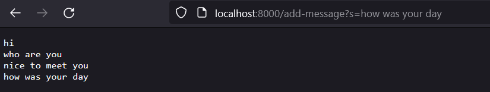
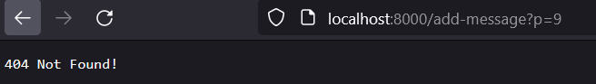
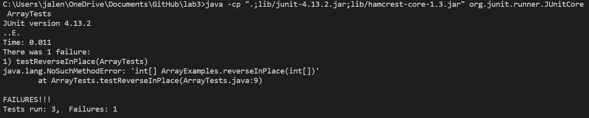
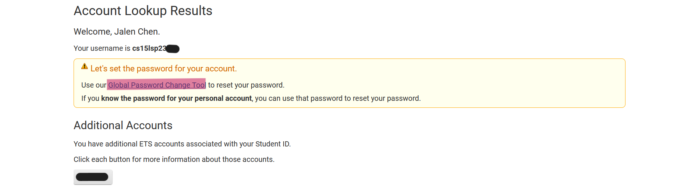

# Lab Report 2
## Part 1 
### String Server Code
    import java.io.IOException;
    import java.net.URI;

    class HandlerS implements URLHandler {
      String text = "";

      public String handleRequest(URI url) {
          if (url.getPath().equals("/")) {
              return text;
          }
          else {
              System.out.println("Path: " + url.getPath());
              if (url.getPath().contains("/add-message")) {
                  String[] parameters = url.getQuery().split("=");
                  if (parameters[0].equals("s")) {
                      text += parameters[0] + "\n";
                      return text;
                  }
              }
          }
          return "404 Not Found!";
          }

    }

    class StringServer {
      public static void main(String[] args) throws IOException {
          if(args.length == 0){
              System.out.println("Missing port number! Try any number between 1024 to 49151");
              return;
          }

          int port = Integer.parseInt(args[0]);

          Server.start(port, new Handler());
      }
    }
Screenshots:

Methods Called:
  - public String handleRequest(URI url), url.getPath(), url.getQuery(), .equals(), .contains(), and .split()
    1. Using the URI generated by Java, the if-else statement check for the path provided. In this case, the path is "/add-message" so the code then checks for the query.
    2. The query is "s=how was your day" and is split along "=". The resulting array is a string array of length 2 looking like this: [s, how was your day].
    3. The code then takes the string in index 1 of this resulting array and concatenates it to the String field text. It also adds a new line after for future  requests.
  
  The String field "text" was changed. The method calls resulted in the new string "how was your day" to be concatenated to a new line of it. 

Methods Called:
  - public String handleRequest(URI url), url.getPath(), url.getQuery(), .equals(), .contains(), and .split()
    1. Using the URI generated by Java, the if-else statement check for the path provided. In this case, the path is "/add-message" so the code then checks for the query.
    2. The query is "p=9" and is split along "=". Since the first argument of this resulting array is "p" and not "s," the string "9" is not added to the String field text.
    3. The code then returns an error message.

The if-else statements reached the end and an error message was returned. Therefore, no field values got changed. 
## Part 2
### Failure Inducing Input
      @Test 
      public void testReverseInPlace() {
        int[] input1 = { 3 };
        int[] arr2 = {1,2,3,4};
        ArrayExamples.reverseInPlace(input1);
        assertArrayEquals(new int[]{ 3 }, ArrayExamples.reverseInPlace(input1));
        assertArrayEquals(new int[] {4,3,2,1}, ArrayExamples.reverseInPlace(arr2)); 
      }
   Output: 
### Passing Input
	@Test 
	public void testReverseInPlace() {
    int[] input1 = { 3 };
    ArrayExamples.reverseInPlace(input1);
    assertArrayEquals(new int[]{ 3 }, input1);
	}
Output: 
          
### Code with Bugs
    static void reverseInPlace(int[] arr) {
      for(int i = 0; i < arr.length; i += 1) {
        arr[i] = arr[arr.length - i - 1];
      }
    }

### Fixed Code
    static int[] reverseInPlace(int[] arr) {
      for(int i = 0; i < arr.length/2; i += 1) {
        int temp = arr[i];
        arr[i] = arr[arr.length-1-i];
        arr[arr.length-1-i] = temp;
      }
        return arr;
    }

The first bug is the incorrect return type. The original code had a void return type when it was supposed to return the reversed array. Secondly, the implementation to reverse the array is wrong too. It loops through the array and correctly replaces the first half of the array with the second half. Since the first half of the array is reversed, the original code replaces the second half with the first half of the array, effectively replacing the second half of the array with itself. The fixed code resolves this issue by only looping through one half of the array and switching the elements at the first and last index, the second index and second-to-last index, and so on. 

## Part 3

These past two weeks, I learned how to connect onto a remote computer and run commands on it. I also learned how to create a web server and host it on a remote computer as well. In addition, I gained expereince working with Github and pushing changes I made so that it would be saved in the repository. 
