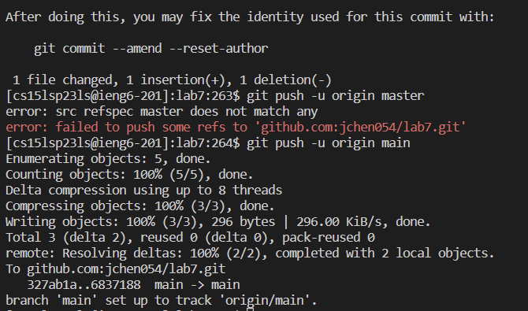

# Lab Report 4
## Step 4: 
Keys Pressed: ` ssh <Ctrl> v ` I had my ieng6 account username on my clipboard so to login I typed ssh and then pased my username.

## Step 5: 
Keys Pressed: ` git clone <Ctrl> <V> cd l <tab> ` After forking the repository, I copied the ssh clone URL. To clone this in my ieng6 account, I typed git clone, then pasted the url. After this, I changed the current directory by using the command cd, typing l and then tab, which filled in the rest of lab7.

## Step 6:
`bash test.sh` Typing bash and test.sh allowed me to confirm that the tests were initially failing and that I needed to edit ListExamples.

## Step 7
`vim Li <tab> . <tab>` The first tab autocompleted "ListExamples" after I typed "Li" and the second tab autocompleted ".java" after I typed ".". `/change` This searches for the first instance of the 
word "change" in the file, which happened to occur in the comment above the line I needed to edit. `j l l` This moved my cursor above the 1 I need to change. `r 2`
This replaced the 1 in index1 to index2. `:wq` This allowed me to save the changes I made to ListExamples.java and to exit vim mode. 

## Step 8:
`<up> <up>` The command to run the tests was 2 commands up, so I pressed the up key twice to run that command again. This time, the tests passed. 

## Step 9
`git add Li <tab> . <tab>` The first and second tab autocompleted ListExamples.java. Then, the add command includes the changes I made to file to be commited and pushed to the  repository. `git commit -m "changed"` This commits the changes I made to the repository. Overall, this process took me about 6 minutes. 

 
