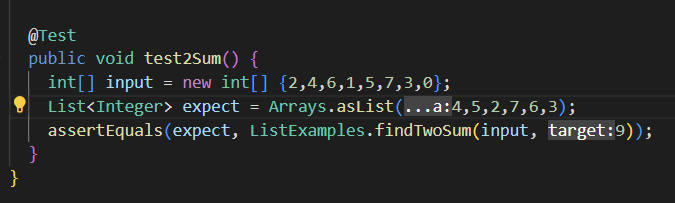
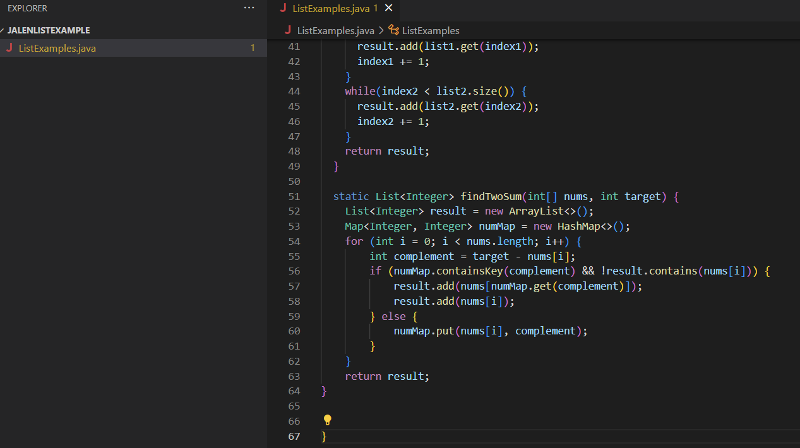
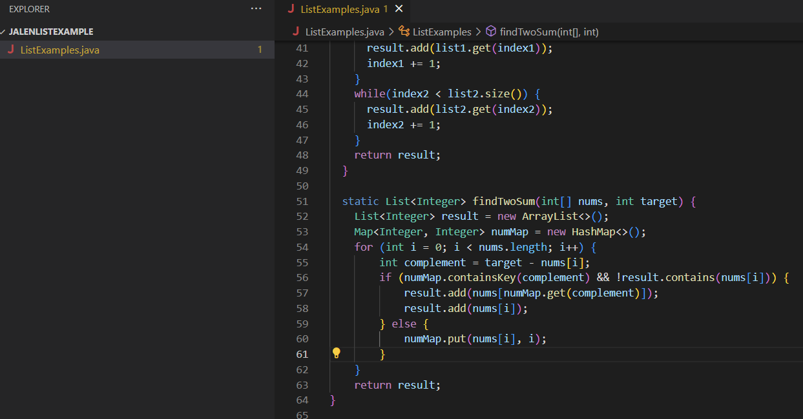
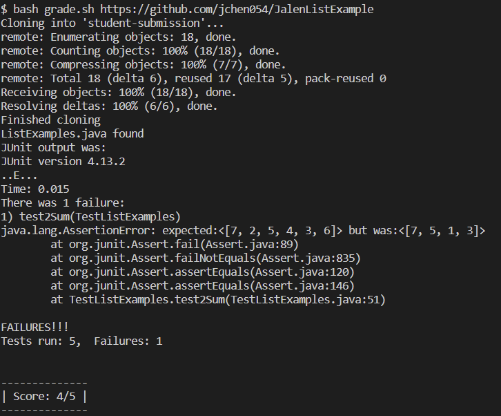
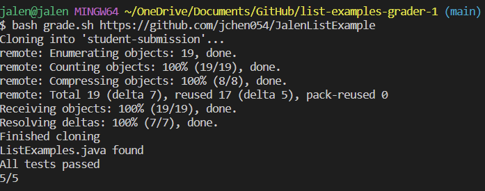

# Lab Report 5

---
## Edstem Post
**What environment are you using (computer, operating system, web browser, terminal/editor, and so on)?**

i am on a windows 10 laptop and using vs code 

**Detail the symptom you're seeing. Be specific; include both what you're seeing and what you expected to see instead. 
Screenshots are great, copy-pasted terminal output is also great. Avoid saying “it doesn't work”.**

Help I dont know what is wrong I am trying to write a method to solve the 2 sum problem where given an array of integers, return a list containing the
pairs of 2 numbers that add up to the target sum. I am running the grade script to check my code from my own repository but the Junit test is failing on the 
expected output, even though I doubled checked that it should be the correct output given the input.

**Detail the failure-inducing input and context. That might mean any or all of the command you're running, a test case, command-line arguments, working directory, 
even the last few commands you ran. Do your best to provide as much context as you can.**

The failure inducing input is the input array for the junit test. I think the method I wrote is likely not iterating through the array and properly storing pairs of  
numbers that add up the target sum, but I cannot find where in the method I made the mistake. I think my tests and grading script are correct. 

---
---
## TA Response

Hi Student,
Consider what numbers you are accessing from the HashMap: you are accessing the value associated with each key in the HashMap and passing it as the index. Are you sure you 
want to map each number in the array to its complement? 

---

## Student
I realized that the bug was mapping each number in the array to its complement. Instead, I should have mapped each number in the array to its index, as I needed to access it
when storing the pairs in the returned List. This way, the correct index is used when accessing an element from the input array. 

---

## Code/Screenshots
Grading Script
```
CPATH='.;lib/hamcrest-core-1.3.jar;lib/junit-4.13.2.jar'

rm -rf student-submission
git clone $1 student-submission
echo 'Finished cloning'

if [[ -f student-submission/ListExamples.java ]]
then
  echo 'ListExamples.java found'
else
  echo 'ListExamples.java not found'
  echo 'Score: 0/4'
  exit
fi

cp student-submission/ListExamples.java ./

javac -cp $CPATH *.java

java -cp $CPATH org.junit.runner.JUnitCore TestListExamples > junit-output.txt

# The strategy used here relies on the last few lines of JUnit output, which
# looks like:

# FAILURES!!!
# Tests run: 4,  Failures: 2

# We check for "FAILURES!!!" and then do a bit of parsing of the last line to
# get the count
FAILURES=`grep -c FAILURES!!! junit-output.txt`

if [[ $FAILURES -eq 0 ]]
then
  echo 'All tests passed'
  echo '5/5'
else
  # The ${VAR:N:M} syntax gets a substring of length M starting at index N
  # Note that since this is a precise character count into the "Tests run:..."
  # string, we'd need to update it if, say, we had a double-digit number of
  # tests. But it's nice and simple for the purposes of this script.

  # See, for example:
  # https://stackoverflow.com/questions/16484972/how-to-extract-a-substring-in-bash
  # https://www.gnu.org/savannah-checkouts/gnu/bash/manual/bash.html#Shell-Parameter-Expansion

  RESULT_LINE=`grep "Tests run:" junit-output.txt`
  COUNT=${RESULT_LINE:25:1}
  CORRECT=$((5-$COUNT))
  echo "JUnit output was:"
  cat junit-output.txt
  echo ""
  echo "--------------"
  echo "| Score: $CORRECT/5 |"
  echo "--------------"
  echo ""
fi
```

Relevant Test in ListTestExamples.java




Buggy Code:
On line 60, instead of mapping each number in the array to complement, it was mapped to i, the index of that number.

Fixed Code:


Outputs:

Failure Output:



Passing Output:



